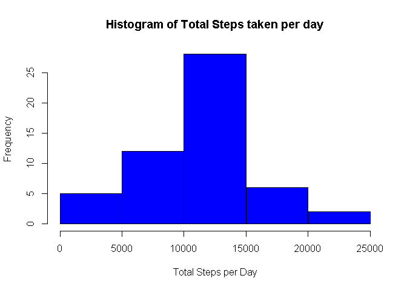
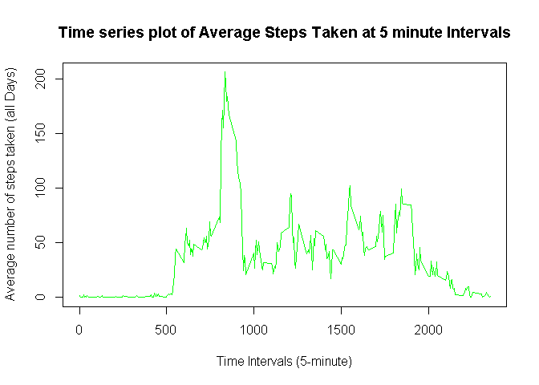
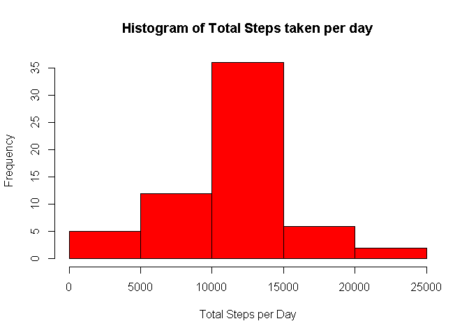
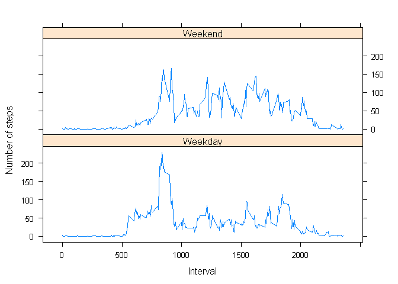

# Reproducible Research: Peer Assessment 1


## Loading and preprocessing the data
Load csv file   

```r
activitydata <- read.csv("activity/activity.csv")
activitydata$date <- as.Date(activitydata$date, "%Y-%m-%d")
summary(activitydata)
```

```
##      steps             date               interval     
##  Min.   :  0.00   Min.   :2012-10-01   Min.   :   0.0  
##  1st Qu.:  0.00   1st Qu.:2012-10-16   1st Qu.: 588.8  
##  Median :  0.00   Median :2012-10-31   Median :1177.5  
##  Mean   : 37.38   Mean   :2012-10-31   Mean   :1177.5  
##  3rd Qu.: 12.00   3rd Qu.:2012-11-15   3rd Qu.:1766.2  
##  Max.   :806.00   Max.   :2012-11-30   Max.   :2355.0  
##  NA's   :2304
```


## What is mean total number of steps taken per day?
Get total number of steps for each day

```r
totalsteps <- tapply(activitydata$steps, activitydata$date, sum)
```

Plot histogram of the total number of steps taken each day

```r
hist(totalsteps, col="blue", xlab="Total Steps per Day", ylab="Frequency", main="Histogram of Total Steps taken per day")
```

 

Calculate Mean total number of steps steps taken per day

```r
mean(totalsteps, na.rm=TRUE)
```

```
## [1] 10766.19
```

Calculate Median total number of steps taken per day

```r
median(totalsteps, na.rm=TRUE)
```

```
## [1] 10765
```


## What is the average daily activity pattern?

Compute mean of steps over all days by time interval

```r
meansteps <- tapply(activitydata$steps,activitydata$interval,
                                 mean,na.rm=TRUE)
```
Plot the 5 minutes internval of average number of steps taken, average across all days

```r
plot(row.names(meansteps), meansteps,type="l",
     xlab="Time Intervals (5-minute)", 
     ylab="Average number of steps taken (all Days)", 
     main="Time series plot of Average Steps Taken at 5 minute Intervals",
     col="Green")
```

 
Find the time interval that contains maximum average number of steps 

```r
intervalnum <- which.max(meansteps)
intervalwithmaxsteps <- names(intervalnum)
intervalwithmaxsteps
```

```
## [1] "835"
```

The ** 835** minute  or ** 104th ** 5 minute interval contains the maximum number of steps on average across all the days. 


## Imputing missing values

Compute the number of NA values in the activity dataset

```r
numna <- sum(is.na(activitydata))
numna 
```

```
## [1] 2304
```

Fill in missing values using the **mean interval value across all days**

```r
naindices <-  which(is.na(activitydata))
imputedvalues <- meansteps[as.character(activitydata[naindices,3])]
names(imputedvalues) <- naindices
for (i in naindices) {
    activitydata$steps[i] = imputedvalues[as.character(i)]
}
sum(is.na(activitydata)) 
```

```
## [1] 0
```

```r
totalsteps <- tapply(activitydata$steps, activitydata$date,sum)
hist(totalsteps,col="red",xlab="Total Steps per Day", 
      ylab="Frequency", main="Histogram of Total Steps taken per day")
```

 

Mean and median values for steps taken per day are higher after imputing missing data. In original data the NA value are replaced by 0 default, whereas with imputed missing data we replace them with the mean intervalu value which is great than zero, this has the effect of pumping up those values. 


```r
mean(totalsteps)
```

```
## [1] 10766.19
```

```r
median(totalsteps)
```

```
## [1] 10766.19
```


## Are there differences in activity patterns between weekdays and weekends?


```r
library(lattice)

days <- weekdays(activitydata$date)
activitydata$day_type <- ifelse(days == "Saturday" | days == "Sunday", 
                                "Weekend", "Weekday")
meansteps <- aggregate(activitydata$steps,
                                    by=list(activitydata$interval,
                                            activitydata$day_type),mean)
names(meansteps) <- c("interval","day_type","steps")
xyplot(steps~interval | day_type, meansteps,type="l",
       layout=c(1,2),xlab="Interval",ylab = "Number of steps")
```

 

The mean, median, max and min of the steps across all intervals and days by Weekdays/Weekends are as follows:

```r
tapply(meansteps$steps,meansteps$day_type,
       function (x) { c(MIN=min(x),MEAN=mean(x),
                        MEDIAN=median(x),MAX=max(x))})
```

```
## $Weekday
##       MIN      MEAN    MEDIAN       MAX 
##   0.00000  35.61058  25.80314 230.37820 
## 
## $Weekend
##       MIN      MEAN    MEDIAN       MAX 
##   0.00000  42.36640  32.33962 166.63915
```
